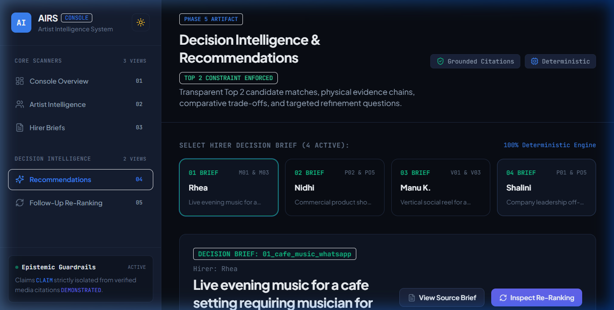
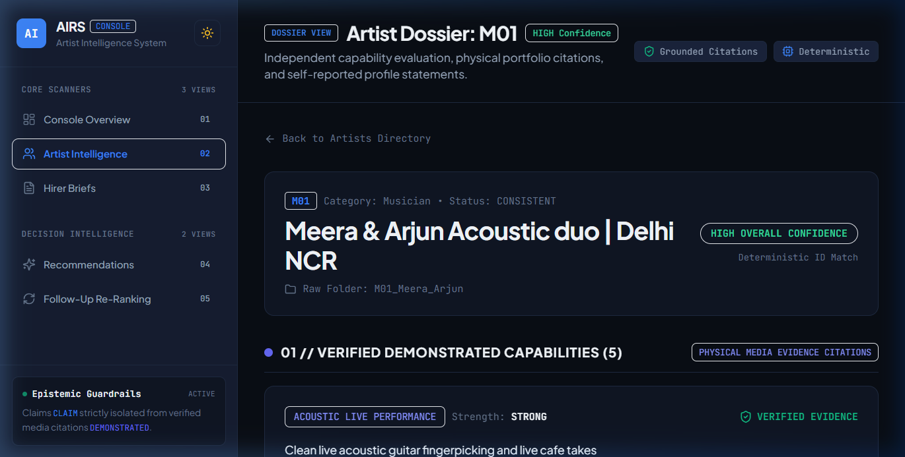
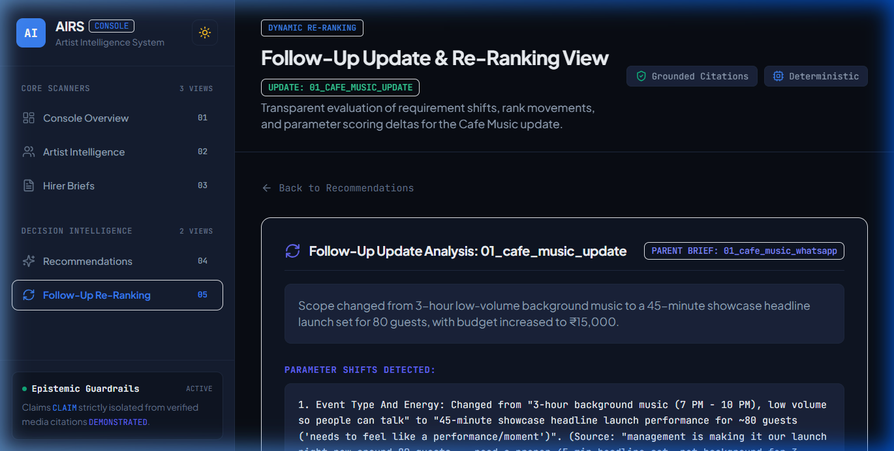

# Artist Intelligence & Recommendation System (AIRS)

> An evidence-led decision intelligence system that evaluates creative talent from multimodal portfolio evidence and matches them to sparse, incomplete hirer conversations.

---

## 1. Project Purpose

AIRS addresses two connected creative marketplace intelligence problems defined in the SEKERON Stage 3 assessment:
1. **Artist Intelligence:** Evaluating incomplete portfolio profiles containing self-reported claims, non-standard folder conventions, and multimodal work samples to establish verified capabilities without making unsupported personality judgments.
2. **Contextual Recommendations:** Interpreting informal, ambiguous hirer conversations to generate transparent **Top 2 recommendations**, comparative trade-offs, explicit uncertainty boundaries, and at most **two high-impact refinement questions**, followed by **dynamic re-ranking** when new scope information arrives.

---

## 2. Assignment Requirement → Implementation Mapping

| Assignment Requirement (PDF) | How AIRS Implements It | Evidence / Location |
| :--- | :--- | :--- |
| **All 15 Artists Across 3 Categories** | Processes 5 photographers, 5 musicians, and 5 video editors from immutable raw data (`data/raw/Data set/`). | [`dataset_inventory.json`](data/processed/dataset_inventory.json) |
| **Category-Specific Capability Dimensions** | Defined distinct taxonomies per domain (e.g., *Acoustic Live Performance* vs *Controlled Studio Lighting* vs *Vertical Short-Form Editing*). | [`capability_dimensions.py`](src/framework/capability_dimensions.py) |
| **Epistemic State Separation** | Mathematically separates verified evidence (`DEMONSTRATED_EVIDENCE`) from self-reported claims (`CLAIM`), assumptions (`ASSUMPTION`), and missing data (`UNKNOWN`). | [`models/common.py`](src/models/common.py), [`scorer.py`](src/matching/scorer.py) |
| **Evidence Citations with Timestamps/Frames** | Cites exact file paths, container parameters, image frame dimensions, and audio/video timestamp intervals. | [`artist_intelligence.jsonl`](data/processed/artist_intelligence.jsonl) |
| **Explicit Uncertainty & Neutral Unknowns** | Unobserved dimensions are marked `UNKNOWN` with zero positive credit and **zero negative penalty** (*Unknown $\neq$ Incapable*). | [`decision_note.md`](decision_note.md), [`scorer.py`](src/matching/scorer.py) |
| **Sensible Media Selection Policy** | Heuristic sampling selecting top 4–6 representative assets per artist based on format and validity, logging all exclusions. | [`media_selection_log.json`](data/processed/media_selection_log.json) |
| **Preservation of Dataset Anomalies** | Preserves raw typos (`PO4`, `PO5`, `VO4`, `VO5`), multi-artist folder splits (`V03`), and corrupted folders without manual repair. | [`dataset_inventory.json`](data/processed/dataset_inventory.json) |
| **Hirer Intent & Transcript Grounding** | Ingests 4 conversational briefs with 100% verbatim quote backing for requirements, constraints, and ambiguities. | [`hirer_intelligence.json`](data/processed/hirer_intelligence.json) |
| **Top 2 Recommendations & Trade-Offs** | Evaluates category candidates, generates ScoreBreakdowns, comparative dimensional trade-offs, and dynamic fit rationales. | [`recommendations.json`](data/processed/recommendations.json) |
| **Max 2 High-Impact Refinement Questions** | Formulates up to 2 prioritized questions targeting decision-critical unknowns capable of flipping rank order. | [`ranking.py`](src/matching/ranking.py) |
| **Dynamic Follow-Up Re-Ranking** | Ingests `01_cafe_music_update`, clones brief, recalculates candidate scores, and logs rank deltas and explanations. | [`updated_recommendation.json`](data/processed/updated_recommendation.json) |

---

## 3. Actual Technical Pipeline

```text
Raw Artist Profiles + Portfolio Media (149 Files) + Hirer Conversations (4 Briefs + 1 Follow-Up)
                                      ↓
      Dataset Ingestion & Anomaly Preserving Scanner (src/ingestion/)
                                      ↓
      Physical Container Inspection (Pillow / Headers) + Human Portfolio Annotations
                                      ↓
      Structured Intelligence Generation (artist_intelligence.jsonl, hirer_intelligence.json)
      [DEMONSTRATED_EVIDENCE | CLAIM | ASSUMPTION | UNKNOWN]
                                      ↓
      Category-Isolated Scoring Engine (src/matching/scorer.py)
      [Requirement Fit (Max 50) + Evidence Strength (Max 30) + Constraint Baseline (20) - Penalties]
                                      ↓
      Top 2 Recommendation & Trade-Off Synthesizer (src/matching/ranking.py, tradeoffs.py)
                                      ↓
      Decision-Critical Refinement Question Selector (Max 2 Questions)
                                      ↓
      Follow-Up Parameter Propagation & Re-Ranking Engine (src/matching/reranking.py)
```

### Implementation Architecture & Boundaries:
- **Media Analyzers (`inspect_image_asset`, `inspect_audio_asset`, `inspect_video_asset`):** Programmatically extract verifiable file metadata (Pillow resolution, aspect ratio tiers, format, file sizes, container validation).
- **Semantic Capabilities (`artist_capability_annotations.json`):** Semantic observations (e.g., *"two-part vocal harmony"*, *"controlled cosmetic reflection"*) originate from human portfolio review stored in an externalized JSON database.
- **Decoupled Scoring & Matching:** The scoring engine, ranking logic, trade-off analyzer, and re-ranking pipeline contain **zero hardcoded artist ID conditions**. Unseen artists fallback cleanly to `UNKNOWN` dimensions.

---

## 4. Evidence and Epistemic Boundaries

AIRS classifies all domain information into four strictly isolated epistemic tiers:

| Epistemic State | Operational Definition | Scoring Weight | Example |
| :--- | :--- | :--- | :--- |
| `DEMONSTRATED_EVIDENCE` | Observable capability directly substantiated by raw portfolio media assets. | **100% credit** (1.0x) + Evidence Bonus | Live video clip showing acoustic fingerpicking and vocal harmony. |
| `CLAIM` | Self-reported assertion in profile document without verifying media sample. | **40% max credit** (0.4x) | Profile states *"expert in drone videography"*, but no drone files exist. |
| `ASSUMPTION` | Operational inference derived from venue type or gig situation. | **Context only** (0.0x) | Assuming 80-guest cafe venue requires compact equipment footprint. |
| `UNKNOWN` | Required dimension unaddressed in portfolio or hirer conversation. | **Neutral** (0.0x, 0 penalty) | Unknown if artist owns a portable PA system (*Unknown $\neq$ Incapable*). |

> **Epistemic Rule:** Missing information is never penalized as negative capability. An artist lacking food video samples receives 0 requirement points for food editing, but suffers no penalty deduction.

---

## 5. Recommendation and Re-Ranking Logic

### Mathematical Scoring Formula
The match score $S \in [0, 100]$ between candidate artist $A$ and brief $B$ is computed as:

$$S = \text{Fit}(A, B) + \text{EvidenceBonus}(A, B) + \text{ConstraintScore}(A, B) - \text{Penalty}(A, B)$$

1. **Requirement Fit Score ($\le 50.0$ pts):**
   $$\text{Fit}(A, B) = \min\left(50.0, \sum_{r \in B.\text{reqs}} w_{\text{base}} \times M_{\text{importance}}(r) \times M_{\text{status}}(A, r)\right)$$
   - Base points per requirement: $w_{\text{base}} = 50.0 / N_{\text{reqs}}$
   - Importance Multipliers ($M_{\text{importance}}$): `CRITICAL` = 1.2, `HIGH` = 1.0, `MEDIUM` = 0.8, `LOW` = 0.5
   - Epistemic Status Multipliers ($M_{\text{status}}$): `DEMONSTRATED` = 1.0, `CLAIM` = 0.4, `UNKNOWN` = 0.0
2. **Evidence Strength Bonus ($\le 30.0$ pts):**
   $$\text{EvidenceBonus}(A, B) = \min\left(30.0, \sum_{c \in \text{citations}} \text{Bonus}(c.\text{strength})\right)$$
   - Bonus points: `STRONG` = +6.0, `MODERATE` = +4.0, `WEAK` = +2.0, `CLAIM` = +1.0
3. **Constraint Compatibility Baseline ($20.0$ pts):**
   - Starts at $+20.0$. Deducts $-5.0$ for soft preference mismatches.
4. **Conflict Penalties:**
   - Deducts $-10.0$ for explicit capability conflicts (e.g., high-decibel heavy metal band applied to quiet acoustic brief).

### Follow-Up Re-Ranking Execution
When `01_cafe_music_update` modifies scope from ambient background music to a 45-minute headline showcase:
1. `_apply_follow_up_to_brief` injects `headline_stage_dynamism` (`CRITICAL` importance) into a cloned `HirerBrief`.
2. The pipeline re-runs `rank_artists_for_brief` across all musician candidates.
3. Candidate `M01` (*Meera & Arjun*) rises to Rank 1 ($82.0 \to 86.8$) due to demonstrated dynamic medley assets, while `M03` (*Raghav Sen*) shifts to Rank 2 ($85.0 \to 80.0$) due to unaddressed headline energy.

---

## 6. Evaluation and Verification

AIRS includes comprehensive automated regression, compliance, and end-to-end verification suites.

```bash
# 1. Run full Python test suite (69 tests)
python -m pytest -v

# 2. Run master compliance & reproducibility verification
python scripts/verify_all.py

# 3. Run frontend unit tests (9 tests)
npm test --prefix frontend

# 4. Validate frontend production build
npm run build --prefix frontend
```

### Verification Test Suite Results:
- **`pytest -v`:** **69 / 69 passed** (100% passing across inventory, models, pipelines, API, and scoring remediation).
- **`scripts/verify_all.py`:** **9 / 9 compliance checks passed** (validating all JSON/JSONL schemas, anomaly preservation, quotation backing, Top 2 enforcement, $\le 2$ questions limit, and follow-up delta verification).
- **`npm test --prefix frontend`:** **9 / 9 passed** (2 test suites covering API client retry logic and decision components).
- **`npm run build --prefix frontend`:** **8 / 8 routes compiled successfully** with zero TypeScript or build errors.

---

## 7. Limitations and Honest Scope

In strict accordance with the Stage 3 assessment scope boundaries:

1. **Controlled Assessment Scale:** The evaluation dataset consists of 15 synthetic/anonymized artist profiles and 4 conversational briefs.
2. **Semantic Annotation Grounding:** Creative capability tagging relies on human-reviewed structured annotations rather than runtime deep learning or computer vision inference.
3. **Deterministic Heuristic Matching:** The scoring engine is rule-based and deterministic rather than trained on historical conversion or hiring outcome data.
4. **No Trust or Personality Profiling:** Per assessment rules, the system explicitly does not infer punctuality, character, reliability, or friendliness from portfolio media or profile photos.
5. **Production Requirements:** Expanding to production scale would require automated media feature extraction models, embedding-based semantic retrieval, annotation verification governance, and continuous human-in-the-loop validation.

---

## 8. Optional Interactive Inspection

> **Note on Frontend & Deployment:** The original assignment explicitly prioritizes the decision system and evidence pipeline. The web interface and cloud deployment below are **optional inspection layers** provided solely to facilitate interactive exploration of the evidence records, score breakdowns, trade-offs, and re-ranking dynamics.

- **Live Web Console:** [https://artist-intelligence-recommendation.vercel.app](https://artist-intelligence-recommendation.vercel.app)
- **Source Code Repository:** [https://github.com/gagandeepsingh76/artist-intelligence-recommendation-system](https://github.com/gagandeepsingh76/artist-intelligence-recommendation-system)

---

## 9. Functional Screenshots

### 1. Decision Intelligence & Top 2 Recommendation View

*Evidence-led recommendation view displaying candidate rankings, mathematical score breakdowns, demonstrated citations, comparative trade-offs, and $\le 2$ refinement questions.*

### 2. Artist Intelligence & Grounded Evidence Dossier

*Structured artist capability dossier demonstrating strict epistemic separation between self-reported profile claims and verified multimodal media citations.*

### 3. Dynamic Follow-Up Re-Ranking & Score Movements

*Transparent re-ranking view showing updated hirer parameters propagating into recalculated candidate match scores, rank movement deltas, and rationale explanations.*

---

## 10. Quickstart & Local Reproduction

### Prerequisites
- Python 3.10+
- Node.js 18+ (optional, for web console)

### Single Documented Run Command
To run the entire pipeline from scratch, regenerate all verified artifacts, and run the complete test suite:

```bash
# Install Python dependencies
pip install -r requirements.txt

# Execute end-to-end verification script (reproduces and validates all artifacts)
python scripts/verify_all.py
```

### Optional: Running the Web Console Locally
```bash
# Terminal 1: Start FastAPI Backend
python -m uvicorn src.api.main:app --host 127.0.0.1 --port 8000

# Terminal 2: Start Next.js Frontend
cd frontend && npm install && npm run dev
# Open http://localhost:3000 in your browser
```
